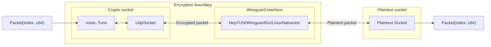

# X-Ray

A tool to inspect the performance of different wireguard implementations

## How it works

The setup consists of two sockets and a wireguard interface. One of the sockets sends and receives encrypted packets (let's call this the crypto socket), and the other sends and receives plaintext packets (let's call this the plaintext socket). The packets that are being sent contain a sequence number so that the receiving socket can now which packet it is, and a timestamp of when it was sent. 

Execution consists of these steps:
1. The wireguard interface is started
2. `tcpdump` is started, with packets being written to a pcap file
3. The main X-Ray executable is started
    1. The crypto client performs a handshake with the wireguard interface
    2. The specified number of packets are sent in the specified direction (crypto->wg interface->plaintext, or plaintext->wg interface->crypto)
    3. The receiving socket registers the packets it receives that are part of the test
    4. The packets are written to a `.csv` file with each row containing the sequence number, the time it was sent and, if it was received, the time it was received
4. `tcpdump` is stopped
5. The wireguard interface is destroyed
6. The `.csv` file and pcap are analyzed

The structure and exeuction of the XRay binary can be represented with the following image:

The red arrows represent crypto packets and the blue arrows represent plaintext packets.

## Running it

X-Ray currently only works on linux

Nordlayer and/or nordvpn might interfere with xray, so try disabling them if you're not receving any of the packets

### Support

Supported adapter types:
- Native
- Neptun
- WireguardGo (needs to be installed beforehand)

### Running the test

The application is executed with xtask, by running `cargo xtask xray`. There are arguments you can pass, all of which are optional. For list of possible arguments, run `cargo xtask xray --help`.

## Known issues

- There are a lot more packets being dropped during a plaintext test than a crypto test, which very likely is caused by the received packets being decrypted upon arrival. Storing all packets as-is and decrypting afterwards would help.

- There is a big discrepancy between how many packets leave the wireguard interface and how many packets arrive at the receiving socket, pointing to some inefficiency within xray itself that affects the results.
