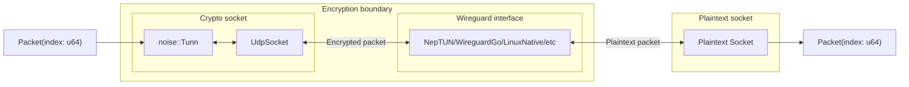

# X-Ray

A tool to inspect the performance of different wireguard implementations

## How it works

The setup consists of two sockets and a wireguard interface. One of the sockets sends and receives encrypted packets (let's call this the crypto socket), and the other sends and receives plaintext packets (let's call this the plaintext socket). The packets that are being sent contain a sequence number so that the receiving socket can now which packet it is, and a timestamp of when it was sent. 

Execution consists of these steps:
1. The wireguard interface is started
2. `tcpdump` is started, with packets being written to a pcap file
3. The main X-Ray executable is started
    1. The crypto client performs a handshake with the wireguard interface
    2. The specified number of packets are sent in the specified direction (crypto->wg interface->plaintext, or plaintext->wg interface->crypto)
    3. The receiving socket registers the packets it receives that are part of the test
    4. The packets are written to a `.csv` file with each row containing the sequence number, the time it was sent and, if it was received, the time it was received
4. `tcpdump` is stopped
5. The wireguard interface is destroyed
6. The `.csv` file and pcap are analyzed

The structure and exeuction of the XRay binary can be represented with the following image:

The red arrows represent crypto packets and the blue arrows represent plaintext packets.

## Running it

X-Ray currently only works on linux

Nordlayer and/or nordvpn might interfere with xray, so try disabling them if you're not receving any of the packets

### Support

Supported adapter types:
- Native
- Neptun
- WireguardGo (needs to be installed beforehand)
- Boringtun (needs to be compiled and placed in the `neptun/target/release` folder beforehand)

### Running the test

The application is executed with the `run.py` script. I takes some arguments, all of which are optional:

- **--wg <adapter type>**: which adapter type to use, accepts one of `neptun`, `native`, `wggo` and `boringtun`. Default is `neptun`

- **--test_type <test type>**: which kind of test to run, accepts `crypto` (to send packets from the crypto socket to the plaintext socket) and `plaintext` (to send packets from the plaintext socket to the crypto socket). Default is `crypto`

- **--count <number of packets>**: How many packets to send. Default is 10

- **--nobuild-neptun**: whether or not to build `neptun-cli` before running. Only relevant when the adaptert type is `neptun`. Default is to build `neptun`

- **--nobuild-xray**: whether or not to build `xray` before running. Default is to build `xray`

- **--save-output**: save the analysis charts in `results` folder.

- **--ascii**: output the analysis chart as text graph.

- **--disable-drop-privileges**: pass the `disable-drop-privileges` flag to `neptun-cli` and `boringtun-cli`.

## Known issues

- The analysis of pcaps is quite limited right now because it doesn't decrypt the packets (this is being worked on)

- There are multiple inefficiencies that could potentially impact the test results, the main one being not reusing buffers when creating and sending packets. Each packet that gets constructed allocates a new buffer when they could all reuse the same one
